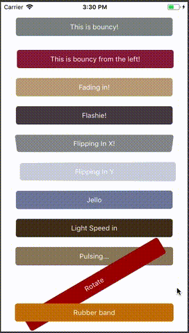

# Simple Animations with Animatable

The previous exercise gave us a powerful mechanism to declare and use animations in our code... But that mechanism was verbose when it comes down to just simple animations...

But instance, I had a refresh button that was just pulsing on a fixed spot and I had to write a few lines of code to get that to work. Not a lot but it would be a lot better to write just one or none.

Fortunately, a group of Javascript devs decided to simplify this to anybody looking for a simple mechanism to introduce animations to stadard controls, this library is [React Native Animatable](https://github.com/oblador/react-native-animatable).

You know what is even better than this? the library has already typescript support!

## What can we do with this library?

Simple animations with very little code.

For instance, my pulsing animation required me to declare a field that was going to drive the animation

```typescript
constructor(props: WhateverProps){
    super(props);

    this.opacityValueForThatButtonWeWillNeedToAnimate = Animated.Value(0);
}
```

Then the render function had to translate whatever value I provided to a range of possible values for the property I am animating...

```typescript
public render() {
    const opacityAnimation = this.opacityValueForThatButtonWeWillNeedToAnimate.interpolate({ inputRange: [0, 1], outputRange: [0, 1]});
    return (
        <View style={[styles.someStyle, { opacity: opacityAnimation }]}>
            {
                // some stuff goes here.
            }
        </View>
    );
}
```

Finally, we need to add our trigger somewhere to get the animation going (in my case, I had a button to kick it in... but you could use `componentDidMount` if you want it to automatically start playing)

```typescript
private startTheAnimation() {
    Animated.lopp( // getting the pulse to get going
        Animated.timing(this.opacityValueForThatButtonWeWillNeedToAnimate, { toValue: 1 }) // specifying which one is the final state... remember that loop will go back to the default of the field.
    , { iterations: 1000 }) // I used a fixed number of iterations just for fun...
    .start();
}
```

What does this looks like in `react-native-animatable`?

```typescript
public render() {
    return (
        <Animatable.View animation="pulse" style={{ backgroundColor: "black" }}>
            {
                // some code goes here...
            }
        </Animatable.View>
    );
}
```

It reduces quite a lot the code, isn't?

Imagine how much code I would've need to write to get this similar output:



There are a lot of other ways to initiate these animations and we don't need to make it as nauseating as I just did above. I do recommend you to check out their docos.

## Things I did not like about this?

With `Animated` we gain a beautiful way of composing out code so the animation did not need to know anything about the component that was going to be affecting... With `Animatable`, if you want a handler/event listener to trigger your animation you will need to register the component to be the target in the references as indicated below:

```typescript
class App extends React.Component {
    componentDidMount() {
        this.refs.targetText.pulse(1000);
    }

    public render() {
        return (
            <View>
                <Animatable.Text ref="targetText">Something something something dark side...</Animatable.Text>
            </View>
        )
    }
}
```

This couples the animation to the specific element you are using (via a named reference) which does not feel very react like... but is pretty easy to use at least.
